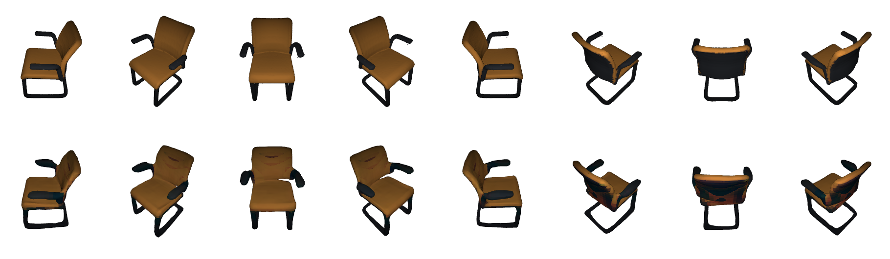

# Texture_Completion

This project is developed within the course "Advanced Deep Learning for Computer Vision" at the TU Munich. The supervisor for my project is Yawar Siddiqui. This project is based on three other projects:
* Occupancy Networks
* Convolutional Occupancy Networks
* Texture Fields

The modified scripts from Occupancy Networks are used for data-processing, 
The from Texture Field

<p float="left">
  
   
</p>
<div style="text-align: center">
  
</div>


## Data Set and Results
Use the following command to download the data and results. The folder `my_dataset` contains the ground truth meshes from the test set and their rendered images. The folder `my_shapenet` contains the pre-processed, whole ShapeNet, chair data set. The folder `shapenet_grid32` contains the trained model, and the predicted, completed meshes and their rendered images. 
```
./download_data.sh
```

Experimental comparison with other state-of-the-art [[1]](#1).

| Method | SSIM | L1 | FID | IoU | Chamfer Distance |
| :- | :-: | :-: | :-: | :-: | :-: |
| **Im2Avatar** | 0.85 | 0.25 | 59.7 | 0.17 | 0.27 |
| **PIFu** | 0.86 | 0.24 | 70.3 | 0.34 | 0.27 |
| **Texture Fields** | **0.93** | 0.20 | 30.3 | 0.46 | 0.20 |
| **SPSG** | **0.93** | **0.19** | **29.0** | **0.66** | 0.09 | 
| **Ours** | 0.89 | 0.22 | 61.9 | 0.59 | **0.04** | 

## Usage

First, implement the three existing Github projects, you can find the original project under the following linkes: [Occupancy Network](https://github.com/autonomousvision/occupancy_networks), [Convolutional Occupancy Networks](https://github.com/autonomousvision/convolutional_occupancy_networks) and [Texture Fields](https://github.com/autonomousvision/texture_fields). <br>
Tips: I could not use the environment.yaml file to create the working environment. I found it works when creating the conda environment manually with the following lines allways work. Install the packages based on their respective channel:

```
conda create -n my_conv_occ python=3.7
conda install -c cython==0.29.2
conda install pytorch==1.0.0 torchvision==0.2.1 -c pytorch
conda install -c conda-forge matplotlib-base==3.0.3
```
Due to memory limitation the data is split into 10 smaller data sets. Change the **data_file** variable in the **generate_dataset.py**, **1_scale.py**, **2_fusion.py** and **sample_mesh.py** to the respective data file, e.g. **data_1.lst**. Use the following command from **Occupancy Networks** to generate data for the network. To make the data pre-processing work, implement the [PyMarchingCubes](https://github.com/JustusThies/PyMarchingCubes) in the `external` folder of the **Occupancy Networks**. Also the `external/mesh-fusion` module consists of three project, [pyrender](https://github.com/griegler/pyrender), [pyfusion](https://github.com/griegler/pyfusion) and [PyMCubes](https://github.com/pmneila/PyMCubes), which did not work for me and I had to implement them seperately. Afterwards run the following command in **Occupancy Networkss**.

```
./data_preprocessing.sh
```
Use the following command to train the network and run the following commands in **Convolutional Occupancy Networks**.
```
python train.py configs/voxel/shapenet_grid32.yaml
```
Use the tensorboard to visualize the training and validation results. The result is stored in the `out/voxels/shapenet_3plane/logs` folder.
```
tensorboard --logdir=/home/zeju/Documents/convolutional_occupancy_networks-master/out/voxels/shapenet_3plane/logs
```
To generate the use the following command to use our pre-trained model.
```
python generate.py configs/voxel/pretrained/shapenet_grid32.yaml
```
For evaluating the geometry reconstruction quality, use the 
```
python eval_meshes.py --dirs=examples/0_in
```
For evaluating the color reconstruction quality, render images of the samples from the test set. Ground truth images and test images are stored in `data/my_dataset/03001627_testset_ply/rendered_images` and `out/voxels/shapenet_grid32/generation/meshes/03001627/rendered_images`. Copy the images to the `data/rendered_images` folder in **Texture Fields**.
```
python render_mesh_image.py
```

To calculate the **SSIM**, **l1 Feature** and **FID** score of our model use the rendered images stored in the `data/rendered_images/gt` and `data/rendered_images/tf` folder and run the following command in **Texture Fields**:
```
python evaluate_metrics.py
```

## References
<a id="1">[1]</a> 
Dai, Angela, et al. "Spsg: Self-supervised photometric scene generation from rgb-d scans." arXiv preprint arXiv:2006.14660 (2020).
